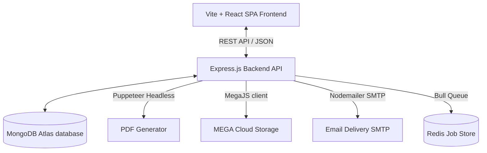

# System Architecture Documentation

This document describes the high-level architecture, software stack, integrations, and data flows of the **Tour Agreement App**.

---

## 🏗️ High-Level Design

The Tour Agreement App is built using a modern decoupled client-server architecture:

---

## 💻 Tech Stack

### 1. Frontend Client
* **Framework**: React 19 (SPA routing via `react-router-dom`).
* **Styling**: Tailwind CSS v4.
* **Libraries**:
  * `axios` for API queries.
  * `react-signature-canvas` for drawing client/admin signatures.
  * `recharts` for metrics and analytics charts.

### 2. Backend Server
* **Framework**: Express.js (Node.js runtime).
* **Database Client**: Mongoose (MongoDB).
* **Security**: JSON Web Tokens (`jsonwebtoken`) + Bcrypt (`bcryptjs`) for password hashing.
* **Media / PDF Engine**: Puppeteer (headless Chrome automation to compile HTML to A4 PDFs).
* **Cloud Storage**: `megajs` client to upload agreements permanently to MEGA.nz cloud storage.
* **Scheduler / Queue (Bull)**: Handles background jobs (emails, analytics, MEGA uploads) off-loading from the main request thread (requires Redis).
* **Email Provider**: `nodemailer` (configured for SMTP/Gmail).

---

## 🔄 Core User & System Flows

### 1. Booking Request Flow (Client)
1. **Client** fills out the booking form on the React frontend and draws their signature.
2. Form is submitted via `POST /api/agreements` to the backend Express server.
3. Express server validates input, generates a unique `trackingId` and sequential `orderNumber`, and saves the document in **MongoDB** with `status: "pending"`.

### 2. Approval & PDF Generation Flow (Admin)
1. **Admin** logs in, reviews pending applications, adds financial values (advance payment, vehicle info), signs, and clicks **Approve** (`PATCH /api/agreements/:id/approve`).
2. Express server sets the status to `"approved"`.
3. The server compiles the agreement HTML template dynamically using the booking + approval data.
4. **Puppeteer** is launched, page content is set to the compiled HTML, and a print-ready PDF buffer is generated.
5. The PDF buffer is uploaded directly to **MEGA cloud storage** using the admin credentials.
6. The public download URL (`pdfUrl`) is saved to the MongoDB document.
7. An email is dispatched (via Nodemailer) with details and the PDF download link.

### 3. Public Tracking & Download Flow
1. **Client** enters their `trackingId` on the homepage.
2. Frontend queries `GET /api/agreements/track/:trackingId`.
3. If approved, the client can view status details and click a download button pointing to `/api/agreements/track/:trackingId/pdf`, which streams the PDF binary directly.
